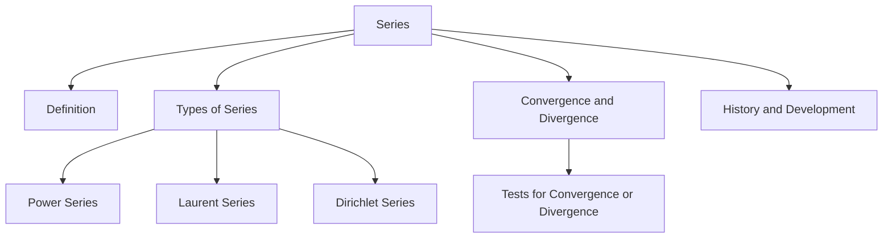

# idea

# wiki-series

---
created: 2023-04-17T11:56:08 (UTC +08:00)
tags: []
source: https://en.wikipedia.org/wiki/Series_(mathematics)
author: Contributors to Wikimedia projects
---

# Series (mathematics) - Wikipedia

> ## Excerpt
> This article is about infinite sums. For finite sums, see Summation.

---
This article is about infinite sums. For finite sums, see [Summation](https://en.wikipedia.org/wiki/Summation "Summation").

In [mathematics](https://en.wikipedia.org/wiki/Mathematics "Mathematics"), a **series** is, roughly speaking, the operation of [adding](https://en.wikipedia.org/wiki/Addition "Addition") infinitely many quantities, one after the other, to a given starting quantity.<a href="https://en.wikipedia.org/wiki/Series_(mathematics)#cite_note-1">[1]</a> The study of series is a major part of [calculus](https://en.wikipedia.org/wiki/Calculus "Calculus") and its generalization, [mathematical analysis](https://en.wikipedia.org/wiki/Mathematical_analysis "Mathematical analysis"). Series are used in most areas of mathematics, even for studying finite structures (such as in [combinatorics](https://en.wikipedia.org/wiki/Combinatorics "Combinatorics")) through [generating functions](https://en.wikipedia.org/wiki/Generating_function "Generating function"). In addition to their ubiquity in mathematics, infinite series are also widely used in other quantitative disciplines such as [physics](https://en.wikipedia.org/wiki/Physics "Physics"), [computer science](https://en.wikipedia.org/wiki/Computer_science "Computer science"), [statistics](https://en.wikipedia.org/wiki/Statistics "Statistics") and [finance](https://en.wikipedia.org/wiki/Finance "Finance").

For a long time, the idea that such a [potentially infinite](https://en.wikipedia.org/wiki/Potential_infinity "Potential infinity") [summation](https://en.wikipedia.org/wiki/Summation "Summation") could produce a finite result was considered [paradoxical](https://en.wikipedia.org/wiki/Paradox "Paradox"). This paradox was resolved using the concept of a [limit](https://en.wikipedia.org/wiki/Limit_(mathematics) "Limit (mathematics)") during the 17th century. [Zeno's paradox](https://en.wikipedia.org/wiki/Zeno%27s_paradox "Zeno's paradox") of [Achilles and the tortoise](https://en.wikipedia.org/wiki/Achilles_and_the_tortoise "Achilles and the tortoise") illustrates this counterintuitive property of infinite sums: Achilles runs after a tortoise, but when he reaches the position of the tortoise at the beginning of the race, the tortoise has reached a second position; when he reaches this second position, the tortoise is at a third position, and so on. [Zeno](https://en.wikipedia.org/wiki/Zeno_of_Elea "Zeno of Elea") concluded that Achilles could _never_ reach the tortoise, and thus that movement does not exist. Zeno divided the race into infinitely many sub-races, each requiring a finite amount of time, so that the total time for Achilles to catch the tortoise is given by a series. The resolution of the paradox is that, although the series has an infinite number of terms, it has a finite sum, which gives the time necessary for Achilles to catch up with the tortoise.

In modern terminology, any (ordered) [infinite sequence](https://en.wikipedia.org/wiki/Sequence_(mathematics) "Sequence (mathematics)")  of [terms](https://en.wikipedia.org/wiki/Summand "Summand") (that is, numbers, [functions](https://en.wikipedia.org/wiki/Function_(mathematics) "Function (mathematics)"), or anything that can be added) defines a series, which is the operation of adding the _a_<i>i</i> one after the other. To emphasize that there are an infinite number of terms, a series may be called an **infinite series**. Such a series is represented (or denoted) by an [expression](https://en.wikipedia.org/wiki/Expression_(mathematics) "Expression (mathematics)") like

or, using the [summation sign](https://en.wikipedia.org/wiki/Summation_sign "Summation sign"),

The infinite sequence of additions implied by a series cannot be effectively carried on (at least in a finite amount of time). However, if the [set](https://en.wikipedia.org/wiki/Set_(mathematics) "Set (mathematics)") to which the terms and their finite sums belong has a notion of [limit](https://en.wikipedia.org/wiki/Limit_(mathematics) "Limit (mathematics)"), it is sometimes possible to assign a value to a series, called the sum of the series. This value is the limit as _n_ tends to [infinity](https://en.wikipedia.org/wiki/Infinity "Infinity") (if the limit exists) of the finite sums of the _n_ first terms of the series, which are called the _n_th **partial sums** of the series. That is,

When this limit exists, one says that the series is **convergent** or **summable**, or that the sequence  is **summable**. In this case, the limit is called the **sum** of the series. Otherwise, the series is said to be **divergent**.<a href="https://en.wikipedia.org/wiki/Series_(mathematics)#cite_note-:0-2">[2]</a>

The notation  denotes both the series—that is the implicit process of adding the terms one after the other indefinitely—and, if the series is convergent, the sum of the series—the result of the process. This is a generalization of the similar convention of denoting by  both the [addition](https://en.wikipedia.org/wiki/Addition "Addition")—the process of adding—and its result—the _sum_ of a and b.

Generally, the terms of a series come from a [ring](https://en.wikipedia.org/wiki/Ring_(mathematics) "Ring (mathematics)"), often the [field](https://en.wikipedia.org/wiki/Field_(mathematics) "Field (mathematics)")  of the [real numbers](https://en.wikipedia.org/wiki/Real_number "Real number") or the field  of the [complex numbers](https://en.wikipedia.org/wiki/Complex_number "Complex number"). In this case, the set of all series is itself a ring (and even an [associative algebra](https://en.wikipedia.org/wiki/Associative_algebra "Associative algebra")), in which the addition consists of adding the series term by term, and the multiplication is the [Cauchy product](https://en.wikipedia.org/wiki/Cauchy_product "Cauchy product").

## Basic properties\[[edit](https://en.wikipedia.org/w/index.php?title=Series_(mathematics)&action=edit&section=1 "Edit section: Basic properties")\]

An infinite series or simply a series is an infinite sum, represented by an [infinite expression](https://en.wikipedia.org/wiki/Infinite_expression "Infinite expression") of the form<a href="https://en.wikipedia.org/wiki/Series_(mathematics)#cite_note-SW501-3">[3]</a>

where  is any ordered [sequence](https://en.wikipedia.org/wiki/Sequence "Sequence") of [terms](https://en.wikipedia.org/wiki/Summand "Summand"), such as [numbers](https://en.wikipedia.org/wiki/Number "Number"), [functions](https://en.wikipedia.org/wiki/Function_(mathematics) "Function (mathematics)"), or anything else that can be [added](https://en.wikipedia.org/wiki/Addition "Addition") (an [abelian group](https://en.wikipedia.org/wiki/Abelian_group "Abelian group")). This is an expression that is obtained from the list of terms  by laying them side by side, and conjoining them with the symbol "+". A series may also be represented by using [summation notation](https://en.wikipedia.org/wiki/Summation#Capital-sigma_notation "Summation"), such as

If an abelian group _A_ of terms has a concept of [limit](https://en.wikipedia.org/wiki/Limit_(mathematics) "Limit (mathematics)") (e.g., if it is a [metric space](https://en.wikipedia.org/wiki/Metric_space "Metric space")), then some series, the [convergent series](https://en.wikipedia.org/wiki/Convergent_series "Convergent series"), can be interpreted as having a value in _A_, called the _sum of the series_. This includes the common cases from [calculus](https://en.wikipedia.org/wiki/Calculus "Calculus"), in which the group is the field of [real numbers](https://en.wikipedia.org/wiki/Real_number "Real number") or the field of [complex numbers](https://en.wikipedia.org/wiki/Complex_number "Complex number"). Given a series , its _k_th **partial sum** is<a href="https://en.wikipedia.org/wiki/Series_(mathematics)#cite_note-:0-2">[2]</a>

By definition, the series  _converges_ to the limit _L_ (or simply _sums_ to _L_), if the sequence of its partial sums has a limit _L_.<a href="https://en.wikipedia.org/wiki/Series_(mathematics)#cite_note-SW501-3">[3]</a> In this case, one usually writes

A series is said to be _convergent_ if it converges to some limit, or _divergent_ when it does not. The value of this limit, if it exists, is then the value of the series.

### Convergent series\[[edit](https://en.wikipedia.org/w/index.php?title=Series_(mathematics)&action=edit&section=2 "Edit section: Convergent series")\]

Illustration of 3 [geometric series](https://en.wikipedia.org/wiki/Geometric_series "Geometric series") with partial sums from 1 to 6 terms. The dashed line represents the limit.

A series Σ_a_<i>n</i> is said to [converge](https://en.wikipedia.org/wiki/Convergent_series "Convergent series") or to _be convergent_ when the sequence (_s_<i>k</i>) of partial sums has a finite [limit](https://en.wikipedia.org/wiki/Limit_of_a_sequence "Limit of a sequence"). If the limit of _s_<i>k</i> is infinite or does not exist, the series is said to [diverge](https://en.wikipedia.org/wiki/Divergent_series "Divergent series").<a href="https://en.wikipedia.org/wiki/Series_(mathematics)#cite_note-4">[4]</a><a href="https://en.wikipedia.org/wiki/Series_(mathematics)#cite_note-:0-2">[2]</a> When the limit of partial sums exists, it is called the value (or sum) of the series

An easy way that an infinite series can converge is if all the _a_<i>n</i> are zero for _n_ sufficiently large. Such a series can be identified with a finite sum, so it is only infinite in a trivial sense.

Working out the properties of the series that converge, even if infinitely many terms are nonzero, is the essence of the study of series. Consider the example

It is possible to "visualize" its convergence on the [real number line](https://en.wikipedia.org/wiki/Real_number "Real number"): we can imagine a [line](https://en.wikipedia.org/wiki/Line_(geometry) "Line (geometry)") of length 2, with successive [segments](https://en.wikipedia.org/wiki/Line_segment "Line segment") marked off of lengths 1, 1/2, 1/4, etc. There is always room to mark the next segment, because the amount of line remaining is always the same as the last segment marked: When we have marked off 1/2, we still have a piece of length 1/2 unmarked, so we can certainly mark the next 1/4. This argument does not prove that the sum is _equal_ to 2 (although it is), but it does prove that it is _at most_ 2. In other words, the series has an upper bound. Given that the series converges, proving that it is equal to 2 requires only [elementary algebra](https://en.wikipedia.org/wiki/Elementary_algebra "Elementary algebra"). If the series is denoted _S_, it can be seen that

Therefore,

The idiom can be extended to other, equivalent notions of series. For instance, a [recurring decimal](https://en.wikipedia.org/wiki/Repeating_decimal "Repeating decimal"), as in

encodes the series

Since these series always converge to [real numbers](https://en.wikipedia.org/wiki/Real_numbers "Real numbers") (because of what is called the [completeness property](https://en.wikipedia.org/wiki/Complete_space "Complete space") of the real numbers), to talk about the series in this way is the same as to talk about the numbers for which they stand. In particular, the decimal expansion 0.111... can be identified with 1/9. This leads to an argument that 9 × 0.111... = 0.999... = 1, which only relies on the fact that the limit laws for series preserve the [arithmetic operations](https://en.wikipedia.org/wiki/Arithmetic_operations "Arithmetic operations"); for more detail on this argument, see [0.999...](https://en.wikipedia.org/wiki/0.999... "0.999...").

## Examples of numerical series\[[edit](https://en.wikipedia.org/w/index.php?title=Series_(mathematics)&action=edit&section=3 "Edit section: Examples of numerical series")\]

-   A _[geometric series](https://en.wikipedia.org/wiki/Geometric_series "Geometric series")_ is one where each successive term is produced by multiplying the previous term by a [constant number](https://en.wikipedia.org/wiki/Mathematical_constant "Mathematical constant") (called the common ratio in this context). For example:<a href="https://en.wikipedia.org/wiki/Series_(mathematics)#cite_note-:0-2">[2]</a>
    
    
    
    In general, the geometric series
    
    
    
    converges [if and only if](https://en.wikipedia.org/wiki/If_and_only_if "If and only if") , in which case it converges to .
    
-   The _[harmonic series](https://en.wikipedia.org/wiki/Harmonic_series_(mathematics) "Harmonic series (mathematics)")_ is the series<a href="https://en.wikipedia.org/wiki/Series_(mathematics)#cite_note-5">[5]</a>
    
    
    
    The harmonic series is [divergent](https://en.wikipedia.org/wiki/Harmonic_series_(mathematics)#Divergence "Harmonic series (mathematics)").
    
-   An _[alternating series](https://en.wikipedia.org/wiki/Alternating_series "Alternating series")_ is a series where terms alternate signs. Examples:
    
    
    
    ([alternating harmonic series](https://en.wikipedia.org/wiki/Alternating_harmonic_series "Alternating harmonic series")) and
    
    
    
-   A [telescoping series](https://en.wikipedia.org/wiki/Telescoping_series "Telescoping series")
    
    
    
    converges if the [sequence](https://en.wikipedia.org/wiki/Sequence "Sequence") _b_<i>n</i> converges to a limit _L_—as _n_ goes to infinity. The value of the series is then _b_1 − _L_.
    
-   An _[arithmetico-geometric series](https://en.wikipedia.org/wiki/Arithmetico-geometric_series "Arithmetico-geometric series")_ is a generalization of the geometric series, which has [coefficients](https://en.wikipedia.org/wiki/Coefficient "Coefficient") of the common ratio equal to the terms in an [arithmetic sequence](https://en.wikipedia.org/wiki/Arithmetic_sequence "Arithmetic sequence"). Example:
    
    
    
-   The [_p_\-series](https://en.wikipedia.org/wiki/Harmonic_series_(mathematics)#P-series "Harmonic series (mathematics)")
    
    
    
    converges if _p_ > 1 and diverges for _p_ ≤ 1, which can be shown with the integral criterion described below in [convergence tests](https://en.wikipedia.org/wiki/Series_(mathematics)#Convergence_tests). As a function of _p_, the sum of this series is [Riemann's zeta function](https://en.wikipedia.org/wiki/Riemann_zeta_function "Riemann zeta function").
    
-   [Hypergeometric series](https://en.wikipedia.org/wiki/Hypergeometric_series "Hypergeometric series"):
    
    ![{\displaystyle _{r}F_{s}\left[{\begin{matrix}a_{1},a_{2},\dotsc ,a_{r}\\b_{1},b_{2},\dotsc ,b_{s}\end{matrix}};z\right]:=\sum _{n=0}^{\infty }{\frac {(a_{1})_{n}(a_{2})_{n}\dotsb (a_{r})_{n}}{(b_{1})_{n}(b_{2})_{n}\dotsb (b_{s})_{n}\;n!}}z^{n}}](https://wikimedia.org/api/rest_v1/media/math/render/svg/1f7cbb150cdf73fa22316d7f89fd9bba6e3ff1c2)
    
    and their generalizations (such as [basic hypergeometric series](https://en.wikipedia.org/wiki/Basic_hypergeometric_series "Basic hypergeometric series") and [elliptic hypergeometric series](https://en.wikipedia.org/wiki/Elliptic_hypergeometric_series "Elliptic hypergeometric series")) frequently appear in [integrable systems](https://en.wikipedia.org/wiki/Integrable_systems "Integrable systems") and [mathematical physics](https://en.wikipedia.org/wiki/Mathematical_physics "Mathematical physics").<a href="https://en.wikipedia.org/wiki/Series_(mathematics)#cite_note-6">[6]</a>
    
-   There are some elementary series whose convergence is not yet known/proven. For example, it is unknown whether the Flint Hills series
    
    
    
    converges or not. The convergence depends on how well  can be approximated with [rational numbers](https://en.wikipedia.org/wiki/Rational_numbers "Rational numbers") (which is unknown as of yet). More specifically, the values of _n_ with large numerical contributions to the sum are the numerators of the continued fraction convergents of , a sequence beginning with 1, 3, 22, 333, 355, 103993, ... (sequence [A046947](https://oeis.org/A046947 "oeis:A046947") in the [OEIS](https://en.wikipedia.org/wiki/On-Line_Encyclopedia_of_Integer_Sequences "On-Line Encyclopedia of Integer Sequences")). These are integers _n_ that are close to  for some integer _m_, so that  is close to  and its reciprocal is large.

### Pi\[[edit](https://en.wikipedia.org/w/index.php?title=Series_(mathematics)&action=edit&section=4 "Edit section: Pi")\]

### Natural logarithm of 2\[[edit](https://en.wikipedia.org/w/index.php?title=Series_(mathematics)&action=edit&section=5 "Edit section: Natural logarithm of 2")\]

<a href="https://en.wikipedia.org/wiki/Series_(mathematics)#cite_note-:0-2">[2]</a>

### Natural logarithm base _e_\[[edit](https://en.wikipedia.org/w/index.php?title=Series_(mathematics)&action=edit&section=6 "Edit section: Natural logarithm base e")\]

## Calculus and partial summation as an operation on sequences\[[edit](https://en.wikipedia.org/w/index.php?title=Series_(mathematics)&action=edit&section=7 "Edit section: Calculus and partial summation as an operation on sequences")\]

Partial summation takes as input a sequence, (_a_<i>n</i>), and gives as output another sequence, (_S_<i>N</i>). It is thus a [unary operation](https://en.wikipedia.org/wiki/Unary_operation "Unary operation") on sequences. Further, this function is [linear](https://en.wikipedia.org/wiki/Linear_map "Linear map"), and thus is a [linear operator](https://en.wikipedia.org/wiki/Linear_operator "Linear operator") on the [vector space](https://en.wikipedia.org/wiki/Vector_space "Vector space") of sequences, denoted Σ. The inverse operator is the [finite difference](https://en.wikipedia.org/wiki/Finite_difference "Finite difference") operator, denoted Δ. These behave as discrete analogues of [integration](https://en.wikipedia.org/wiki/Integral "Integral") and [differentiation](https://en.wikipedia.org/wiki/Derivative "Derivative"), only for series (functions of a natural number) instead of functions of a real variable. For example, the sequence (1, 1, 1, ...) has series (1, 2, 3, 4, ...) as its partial summation, which is analogous to the fact that 

In [computer science](https://en.wikipedia.org/wiki/Computer_science "Computer science"), it is known as [prefix sum](https://en.wikipedia.org/wiki/Prefix_sum "Prefix sum").

## Properties of series\[[edit](https://en.wikipedia.org/w/index.php?title=Series_(mathematics)&action=edit&section=8 "Edit section: Properties of series")\]

Series are classified not only by whether they converge or diverge, but also by the properties of the terms an (absolute or conditional convergence); type of convergence of the series (pointwise, uniform); the class of the term an (whether it is a real number, arithmetic progression, trigonometric function); etc.

### Non-negative terms\[[edit](https://en.wikipedia.org/w/index.php?title=Series_(mathematics)&action=edit&section=9 "Edit section: Non-negative terms")\]

When _an_ is a non-negative real number for every _n_, the sequence _SN_ of partial sums is non-decreasing. It follows that a series Σ_an_ with non-negative terms converges if and only if the sequence _SN_ of partial sums is bounded.

For example, the series

is convergent, because the inequality

and a telescopic sum argument implies that the partial sums are bounded by 2. The exact value of the original series is the [Basel problem](https://en.wikipedia.org/wiki/Basel_problem "Basel problem").

### Grouping\[[edit](https://en.wikipedia.org/w/index.php?title=Series_(mathematics)&action=edit&section=10 "Edit section: Grouping")\]

When you group a series reordering of the series does not happen, so [Riemann series theorem](https://en.wikipedia.org/wiki/Riemann_series_theorem "Riemann series theorem") does not apply. A new series will have its partial sums as subsequence of original series, which means if the original series converges, so does the new series. But for divergent series that is not true, for example [1-1+1-1+...](https://en.wikipedia.org/wiki/1-1%2B1-1%2B... "1-1+1-1+...") grouped every two elements will create 0+0+0+... series, which is convergent. On the other hand, divergence of the new series means the original series can be only divergent which is sometimes useful, like in [Oresme proof](https://en.wikipedia.org/wiki/Harmonic_series_(mathematics)#Comparison_test "Harmonic series (mathematics)").

### Absolute convergence\[[edit](https://en.wikipedia.org/w/index.php?title=Series_(mathematics)&action=edit&section=11 "Edit section: Absolute convergence")\]

A series

_converges absolutely_ if the series of [absolute values](https://en.wikipedia.org/wiki/Absolute_value "Absolute value")

converges. This is sufficient to guarantee not only that the original series converges to a limit, but also that any reordering of it converges to the same limit.

### Conditional convergence\[[edit](https://en.wikipedia.org/w/index.php?title=Series_(mathematics)&action=edit&section=12 "Edit section: Conditional convergence")\]

A series of real or complex numbers is said to be **conditionally convergent** (or **semi-convergent**) if it is convergent but not absolutely convergent. A famous example is the alternating series

which is convergent (and its sum is equal to ), but the series formed by taking the absolute value of each term is the divergent [harmonic series](https://en.wikipedia.org/wiki/Harmonic_series_(mathematics) "Harmonic series (mathematics)"). The [Riemann series theorem](https://en.wikipedia.org/wiki/Riemann_series_theorem "Riemann series theorem") says that any conditionally convergent series can be reordered to make a divergent series, and moreover, if the  are real and  is any real number, that one can find a reordering so that the reordered series converges with sum equal to .

[Abel's test](https://en.wikipedia.org/wiki/Abel%27s_test "Abel's test") is an important tool for handling semi-convergent series. If a series has the form

where the partial sums  are bounded,  has bounded variation, and  exists:

then the series  is convergent. This applies to the point-wise convergence of many trigonometric series, as in

with . Abel's method consists in writing , and in performing a transformation similar to [integration by parts](https://en.wikipedia.org/wiki/Integration_by_parts "Integration by parts") (called [summation by parts](https://en.wikipedia.org/wiki/Summation_by_parts "Summation by parts")), that relates the given series  to the absolutely convergent series

### Evaluation of truncation errors\[[edit](https://en.wikipedia.org/w/index.php?title=Series_(mathematics)&action=edit&section=13 "Edit section: Evaluation of truncation errors")\]

The evaluation of truncation errors is an important procedure in [numerical analysis](https://en.wikipedia.org/wiki/Numerical_analysis "Numerical analysis") (especially [validated numerics](https://en.wikipedia.org/wiki/Validated_numerics "Validated numerics") and [computer-assisted proof](https://en.wikipedia.org/wiki/Computer-assisted_proof "Computer-assisted proof")).

#### [Alternating series](https://en.wikipedia.org/wiki/Alternating_series "Alternating series")\[[edit](https://en.wikipedia.org/w/index.php?title=Series_(mathematics)&action=edit&section=14 "Edit section: Alternating series")\]

When conditions of the [alternating series test](https://en.wikipedia.org/wiki/Alternating_series_test "Alternating series test") are satisfied by , there is an exact error evaluation.<a href="https://en.wikipedia.org/wiki/Series_(mathematics)#cite_note-7">[7]</a> Set  to be the partial sum  of the given alternating series . Then the next inequality holds:

#### [Taylor series](https://en.wikipedia.org/wiki/Taylor_series "Taylor series")\[[edit](https://en.wikipedia.org/w/index.php?title=Series_(mathematics)&action=edit&section=15 "Edit section: Taylor series")\]

[Taylor's theorem](https://en.wikipedia.org/wiki/Taylor%27s_theorem "Taylor's theorem") is a statement that includes the evaluation of the error term when the [Taylor series](https://en.wikipedia.org/wiki/Taylor_series "Taylor series") is truncated.

#### [Hypergeometric series](https://en.wikipedia.org/wiki/Hypergeometric_series "Hypergeometric series")\[[edit](https://en.wikipedia.org/w/index.php?title=Series_(mathematics)&action=edit&section=16 "Edit section: Hypergeometric series")\]

By using the [ratio](https://en.wikipedia.org/wiki/Ratio "Ratio"), we can obtain the evaluation of the error term when the [hypergeometric series](https://en.wikipedia.org/wiki/Hypergeometric_series "Hypergeometric series") is truncated.<a href="https://en.wikipedia.org/wiki/Series_(mathematics)#cite_note-8">[8]</a>

#### [Matrix exponential](https://en.wikipedia.org/wiki/Matrix_exponential "Matrix exponential")\[[edit](https://en.wikipedia.org/w/index.php?title=Series_(mathematics)&action=edit&section=17 "Edit section: Matrix exponential")\]

For the [matrix exponential](https://en.wikipedia.org/wiki/Matrix_exponential "Matrix exponential"):

the following error evaluation holds (scaling and squaring method):<a href="https://en.wikipedia.org/wiki/Series_(mathematics)#cite_note-9">[9]</a><a href="https://en.wikipedia.org/wiki/Series_(mathematics)#cite_note-10">[10]</a><a href="https://en.wikipedia.org/wiki/Series_(mathematics)#cite_note-11">[11]</a>

![{\displaystyle T_{r,s}(X):=\left[\sum _{j=0}^{r}{\frac {1}{j!}}(X/s)^{j}\right]^{s},\quad \|\exp(X)-T_{r,s}(X)\|\leq {\frac {\|X\|^{r+1}}{s^{r}(r+1)!}}\exp(\|X\|).}](https://wikimedia.org/api/rest_v1/media/math/render/svg/44edb2f9a92e8e0edb4dfb0cd955a666e9887edb)

## Convergence tests\[[edit](https://en.wikipedia.org/w/index.php?title=Series_(mathematics)&action=edit&section=18 "Edit section: Convergence tests")\]

There exist many tests that can be used to determine whether particular series converge or diverge.

-   _[n-th term test](https://en.wikipedia.org/wiki/N-th_term_test "N-th term test")_: If , then the series diverges; if , then the test is inconclusive.
-   Comparison test 1 (see [Direct comparison test](https://en.wikipedia.org/wiki/Direct_comparison_test "Direct comparison test")): If  is an [absolutely convergent](https://en.wikipedia.org/wiki/Absolute_convergence "Absolute convergence") series such that  for some number  and for sufficiently large , then  converges absolutely as well. If  diverges, and  for all sufficiently large , then  also fails to converge absolutely (though it could still be conditionally convergent, for example, if the  alternate in sign).
-   Comparison test 2 (see [Limit comparison test](https://en.wikipedia.org/wiki/Limit_comparison_test "Limit comparison test")): If  is an absolutely convergent series such that  for sufficiently large , then  converges absolutely as well. If  diverges, and  for all sufficiently large , then  also fails to converge absolutely (though it could still be conditionally convergent, for example, if the  alternate in sign).
-   [Ratio test](https://en.wikipedia.org/wiki/Ratio_test "Ratio test"): If there exists a constant  such that  for all sufficiently large , then  converges absolutely. When the ratio is less than , but not less than a constant less than , convergence is possible but this test does not establish it.
-   [Root test](https://en.wikipedia.org/wiki/Root_test "Root test"): If there exists a constant  such that  for all sufficiently large , then  converges absolutely.
-   [Integral test](https://en.wikipedia.org/wiki/Integral_test_for_convergence "Integral test for convergence"): if  is a positive [monotone decreasing](https://en.wikipedia.org/wiki/Monotone_decreasing "Monotone decreasing") function defined on the [interval](https://en.wikipedia.org/wiki/Interval_(mathematics) "Interval (mathematics)")  with  for all , then  converges if and only if the [integral](https://en.wikipedia.org/wiki/Integral "Integral")  is finite.
-   [Cauchy's condensation test](https://en.wikipedia.org/wiki/Cauchy%27s_condensation_test "Cauchy's condensation test"): If  is non-negative and non-increasing, then the two series  and  are of the same nature: both convergent, or both divergent.
-   [Alternating series test](https://en.wikipedia.org/wiki/Alternating_series_test "Alternating series test"): A series of the form  (with ) is called _alternating_. Such a series converges if the [sequence](https://en.wikipedia.org/wiki/Sequence "Sequence") __ is [monotone decreasing](https://en.wikipedia.org/wiki/Monotone_decreasing "Monotone decreasing") and converges to . The converse is in general not true.
-   For some specific types of series there are more specialized convergence tests, for instance for [Fourier series](https://en.wikipedia.org/wiki/Fourier_series "Fourier series") there is the [Dini test](https://en.wikipedia.org/wiki/Dini_test "Dini test").

## Series of functions\[[edit](https://en.wikipedia.org/w/index.php?title=Series_(mathematics)&action=edit&section=19 "Edit section: Series of functions")\]

A series of real- or complex-valued functions

[converges pointwise](https://en.wikipedia.org/wiki/Pointwise_convergence "Pointwise convergence") on a set _E_, if the series converges for each _x_ in _E_ as an ordinary series of real or complex numbers. Equivalently, the partial sums

converge to _ƒ_(_x_) as _N_ → ∞ for each _x_ ∈ _E_.

A stronger notion of convergence of a series of functions is the [uniform convergence](https://en.wikipedia.org/wiki/Uniform_convergence "Uniform convergence"). A series converges uniformly if it converges pointwise to the function _ƒ_(_x_), and the error in approximating the limit by the _N_th partial sum,

can be made minimal _independently_ of _x_ by choosing a sufficiently large _N_.

Uniform convergence is desirable for a series because many properties of the terms of the series are then retained by the limit. For example, if a series of continuous functions converges uniformly, then the limit function is also continuous. Similarly, if the _ƒ_<i>n</i> are [integrable](https://en.wikipedia.org/wiki/Integral "Integral") on a closed and bounded interval _I_ and converge uniformly, then the series is also integrable on _I_ and can be integrated term-by-term. Tests for uniform convergence include the [Weierstrass' M-test](https://en.wikipedia.org/wiki/Weierstrass_M-test "Weierstrass M-test"), [Abel's uniform convergence test](https://en.wikipedia.org/wiki/Abel%27s_uniform_convergence_test "Abel's uniform convergence test"), [Dini's test](https://en.wikipedia.org/wiki/Dini%27s_test "Dini's test"), and the [Cauchy criterion](https://en.wikipedia.org/wiki/Cauchy_sequence "Cauchy sequence").

More sophisticated types of convergence of a series of functions can also be defined. In [measure theory](https://en.wikipedia.org/wiki/Measure_theory "Measure theory"), for instance, a series of functions converges [almost everywhere](https://en.wikipedia.org/wiki/Almost_everywhere "Almost everywhere") if it converges pointwise except on a certain set of [measure zero](https://en.wikipedia.org/wiki/Null_set "Null set"). Other [modes of convergence](https://en.wikipedia.org/wiki/Modes_of_convergence "Modes of convergence") depend on a different [metric space](https://en.wikipedia.org/wiki/Metric_space "Metric space") structure on the space of functions under consideration. For instance, a series of functions **converges in mean** on a set _E_ to a limit function _ƒ_ provided

as _N_ → ∞.

### Power series\[[edit](https://en.wikipedia.org/w/index.php?title=Series_(mathematics)&action=edit&section=20 "Edit section: Power series")\]

A **power series** is a series of the form

The [Taylor series](https://en.wikipedia.org/wiki/Taylor_series "Taylor series") at a point _c_ of a function is a power series that, in many cases, converges to the function in a neighborhood of _c_. For example, the series

is the Taylor series of  at the origin and converges to it for every _x_.

Unless it converges only at _x_\=_c_, such a series converges on a certain open disc of convergence centered at the point _c_ in the complex plane, and may also converge at some of the points of the boundary of the disc. The radius of this disc is known as the [radius of convergence](https://en.wikipedia.org/wiki/Radius_of_convergence "Radius of convergence"), and can in principle be determined from the asymptotics of the coefficients _a_<i>n</i>. The convergence is uniform on [closed](https://en.wikipedia.org/wiki/Closed_set "Closed set") and [bounded](https://en.wikipedia.org/wiki/Bounded_set "Bounded set") (that is, [compact](https://en.wikipedia.org/wiki/Compact_set "Compact set")) subsets of the interior of the disc of convergence: to wit, it is [uniformly convergent on compact sets](https://en.wikipedia.org/wiki/Compact_convergence "Compact convergence").

Historically, mathematicians such as [Leonhard Euler](https://en.wikipedia.org/wiki/Leonhard_Euler "Leonhard Euler") operated liberally with infinite series, even if they were not convergent. When calculus was put on a sound and correct foundation in the nineteenth century, rigorous proofs of the convergence of series were always required.

### Formal power series\[[edit](https://en.wikipedia.org/w/index.php?title=Series_(mathematics)&action=edit&section=21 "Edit section: Formal power series")\]

While many uses of power series refer to their sums, it is also possible to treat power series as _formal sums_, meaning that no addition operations are actually performed, and the symbol "+" is an abstract symbol of conjunction which is not necessarily interpreted as corresponding to addition. In this setting, the sequence of coefficients itself is of interest, rather than the convergence of the series. Formal power series are used in [combinatorics](https://en.wikipedia.org/wiki/Combinatorics "Combinatorics") to describe and study [sequences](https://en.wikipedia.org/wiki/Sequence "Sequence") that are otherwise difficult to handle, for example, using the method of [generating functions](https://en.wikipedia.org/wiki/Generating_function "Generating function"). The [Hilbert–Poincaré series](https://en.wikipedia.org/wiki/Hilbert%E2%80%93Poincar%C3%A9_series "Hilbert–Poincaré series") is a formal power series used to study [graded algebras](https://en.wikipedia.org/wiki/Graded_algebra "Graded algebra").

Even if the limit of the power series is not considered, if the terms support appropriate structure then it is possible to define operations such as [addition](https://en.wikipedia.org/wiki/Addition "Addition"), [multiplication](https://en.wikipedia.org/wiki/Multiplication "Multiplication"), [derivative](https://en.wikipedia.org/wiki/Derivative "Derivative"), [antiderivative](https://en.wikipedia.org/wiki/Antiderivative "Antiderivative") for power series "formally", treating the symbol "+" as if it corresponded to addition. In the most common setting, the terms come from a [commutative ring](https://en.wikipedia.org/wiki/Commutative_ring "Commutative ring"), so that the formal power series can be added term-by-term and multiplied via the [Cauchy product](https://en.wikipedia.org/wiki/Cauchy_product "Cauchy product"). In this case the algebra of formal power series is the [total algebra](https://en.wikipedia.org/wiki/Total_algebra "Total algebra") of the [monoid](https://en.wikipedia.org/wiki/Monoid "Monoid") of [natural numbers](https://en.wikipedia.org/wiki/Natural_numbers "Natural numbers") over the underlying term ring.<a href="https://en.wikipedia.org/wiki/Series_(mathematics)#cite_note-12">[12]</a> If the underlying term ring is a [differential algebra](https://en.wikipedia.org/wiki/Differential_algebra "Differential algebra"), then the algebra of formal power series is also a differential algebra, with differentiation performed term-by-term.

### Laurent series\[[edit](https://en.wikipedia.org/w/index.php?title=Series_(mathematics)&action=edit&section=22 "Edit section: Laurent series")\]

Laurent series generalize power series by admitting terms into the series with negative as well as positive exponents. A Laurent series is thus any series of the form

If such a series converges, then in general it does so in an [annulus](https://en.wikipedia.org/wiki/Annulus_(mathematics) "Annulus (mathematics)") rather than a disc, and possibly some boundary points. The series converges uniformly on compact subsets of the interior of the annulus of convergence.

### Dirichlet series\[[edit](https://en.wikipedia.org/w/index.php?title=Series_(mathematics)&action=edit&section=23 "Edit section: Dirichlet series")\]

A [Dirichlet series](https://en.wikipedia.org/wiki/Dirichlet_series "Dirichlet series") is one of the form

where _s_ is a [complex number](https://en.wikipedia.org/wiki/Complex_number "Complex number"). For example, if all _a_<i>n</i> are equal to 1, then the Dirichlet series is the [Riemann zeta function](https://en.wikipedia.org/wiki/Riemann_zeta_function "Riemann zeta function")

Like the zeta function, Dirichlet series in general play an important role in [analytic number theory](https://en.wikipedia.org/wiki/Analytic_number_theory "Analytic number theory"). Generally a Dirichlet series converges if the real part of _s_ is greater than a number called the abscissa of convergence. In many cases, a Dirichlet series can be extended to an [analytic function](https://en.wikipedia.org/wiki/Analytic_function "Analytic function") outside the domain of convergence by [analytic continuation](https://en.wikipedia.org/wiki/Analytic_continuation "Analytic continuation"). For example, the Dirichlet series for the zeta function converges absolutely when Re(_s_) > 1, but the zeta function can be extended to a holomorphic function defined on  with a simple [pole](https://en.wikipedia.org/wiki/Pole_(complex_analysis) "Pole (complex analysis)") at 1.

This series can be directly generalized to [general Dirichlet series](https://en.wikipedia.org/wiki/General_Dirichlet_series "General Dirichlet series").

### Trigonometric series\[[edit](https://en.wikipedia.org/w/index.php?title=Series_(mathematics)&action=edit&section=24 "Edit section: Trigonometric series")\]

A series of functions in which the terms are [trigonometric functions](https://en.wikipedia.org/wiki/Trigonometric_function "Trigonometric function") is called a **trigonometric series**:

The most important example of a trigonometric series is the [Fourier series](https://en.wikipedia.org/wiki/Fourier_series "Fourier series") of a function.

## History of the theory of infinite series\[[edit](https://en.wikipedia.org/w/index.php?title=Series_(mathematics)&action=edit&section=25 "Edit section: History of the theory of infinite series")\]

### Development of infinite series\[[edit](https://en.wikipedia.org/w/index.php?title=Series_(mathematics)&action=edit&section=26 "Edit section: Development of infinite series")\]

[Greek](https://en.wikipedia.org/wiki/Greek_mathematics "Greek mathematics") mathematician [Archimedes](https://en.wikipedia.org/wiki/Archimedes "Archimedes") produced the first known summation of an infinite series with a method that is still used in the area of calculus today. He used the [method of exhaustion](https://en.wikipedia.org/wiki/Method_of_exhaustion "Method of exhaustion") to calculate the [area](https://en.wikipedia.org/wiki/Area "Area") under the arc of a [parabola](https://en.wikipedia.org/wiki/Parabola "Parabola") with the summation of an infinite series, and gave a remarkably accurate approximation of [π](https://en.wikipedia.org/wiki/Pi "Pi").<a href="https://en.wikipedia.org/wiki/Series_(mathematics)#cite_note-13">[13]</a><a href="https://en.wikipedia.org/wiki/Series_(mathematics)#cite_note-14">[14]</a>

Mathematicians from Kerala, India studied infinite series around 1350 CE.<a href="https://en.wikipedia.org/wiki/Series_(mathematics)#cite_note-15">[15]</a>

In the 17th century, [James Gregory](https://en.wikipedia.org/wiki/James_Gregory_(astronomer_and_mathematician) "James Gregory (astronomer and mathematician)") worked in the new [decimal](https://en.wikipedia.org/wiki/Decimal "Decimal") system on infinite series and published several [Maclaurin series](https://en.wikipedia.org/wiki/Maclaurin_series "Maclaurin series"). In 1715, a general method for constructing the [Taylor series](https://en.wikipedia.org/wiki/Taylor_series "Taylor series") for all functions for which they exist was provided by [Brook Taylor](https://en.wikipedia.org/wiki/Brook_Taylor "Brook Taylor"). [Leonhard Euler](https://en.wikipedia.org/wiki/Leonhard_Euler "Leonhard Euler") in the 18th century, developed the theory of [hypergeometric series](https://en.wikipedia.org/wiki/Hypergeometric_series "Hypergeometric series") and [q-series](https://en.wikipedia.org/wiki/Q-series "Q-series").

### Convergence criteria\[[edit](https://en.wikipedia.org/w/index.php?title=Series_(mathematics)&action=edit&section=27 "Edit section: Convergence criteria")\]

The investigation of the validity of infinite series is considered to begin with [Gauss](https://en.wikipedia.org/wiki/Carl_Friedrich_Gauss "Carl Friedrich Gauss") in the 19th century. Euler had already considered the hypergeometric series

on which Gauss published a memoir in 1812. It established simpler criteria of convergence, and the questions of remainders and the range of convergence.

[Cauchy](https://en.wikipedia.org/wiki/Cauchy "Cauchy") (1821) insisted on strict tests of convergence; he showed that if two series are convergent their product is not necessarily so, and with him begins the discovery of effective criteria. The terms _convergence_ and _divergence_ had been introduced long before by [Gregory](https://en.wikipedia.org/wiki/James_Gregory_(astronomer_and_mathematician) "James Gregory (astronomer and mathematician)") (1668). [Leonhard Euler](https://en.wikipedia.org/wiki/Leonhard_Euler "Leonhard Euler") and [Gauss](https://en.wikipedia.org/wiki/Carl_Friedrich_Gauss "Carl Friedrich Gauss") had given various criteria, and [Colin Maclaurin](https://en.wikipedia.org/wiki/Colin_Maclaurin "Colin Maclaurin") had anticipated some of Cauchy's discoveries. Cauchy advanced the theory of [power series](https://en.wikipedia.org/wiki/Power_series "Power series") by his expansion of a complex [function](https://en.wikipedia.org/wiki/Function_(mathematics) "Function (mathematics)") in such a form.

[Abel](https://en.wikipedia.org/wiki/Niels_Henrik_Abel "Niels Henrik Abel") (1826) in his memoir on the [binomial series](https://en.wikipedia.org/wiki/Binomial_series "Binomial series")

corrected certain of Cauchy's conclusions, and gave a completely scientific summation of the series for complex values of  and . He showed the necessity of considering the subject of continuity in questions of convergence.

Cauchy's methods led to special rather than general criteria, and the same may be said of [Raabe](https://en.wikipedia.org/wiki/Joseph_Ludwig_Raabe "Joseph Ludwig Raabe") (1832), who made the first elaborate investigation of the subject, of [De Morgan](https://en.wikipedia.org/wiki/Augustus_De_Morgan "Augustus De Morgan") (from 1842), whose logarithmic test [DuBois-Reymond](https://en.wikipedia.org/wiki/Paul_du_Bois-Reymond "Paul du Bois-Reymond") (1873) and [Pringsheim](https://en.wikipedia.org/wiki/Alfred_Pringsheim "Alfred Pringsheim") (1889) have shown to fail within a certain region; of [Bertrand](https://en.wikipedia.org/wiki/Joseph_Louis_Fran%C3%A7ois_Bertrand "Joseph Louis François Bertrand") (1842), [Bonnet](https://en.wikipedia.org/wiki/Pierre_Ossian_Bonnet "Pierre Ossian Bonnet") (1843), [Malmsten](https://en.wikipedia.org/wiki/Carl_Johan_Malmsten "Carl Johan Malmsten") (1846, 1847, the latter without integration); [Stokes](https://en.wikipedia.org/wiki/George_Gabriel_Stokes "George Gabriel Stokes") (1847), [Paucker](https://en.wikipedia.org/wiki/Paucker "Paucker") (1852), [Chebyshev](https://en.wikipedia.org/wiki/Chebyshev "Chebyshev") (1852), and [Arndt](https://en.wikipedia.org/wiki/Arndt "Arndt") (1853).

General criteria began with [Kummer](https://en.wikipedia.org/wiki/Ernst_Kummer "Ernst Kummer") (1835), and have been studied by [Eisenstein](https://en.wikipedia.org/wiki/Gotthold_Eisenstein "Gotthold Eisenstein") (1847), [Weierstrass](https://en.wikipedia.org/wiki/Weierstrass "Weierstrass") in his various contributions to the theory of functions, [Dini](https://en.wikipedia.org/wiki/Ulisse_Dini "Ulisse Dini") (1867), DuBois-Reymond (1873), and many others. Pringsheim's memoirs (1889) present the most complete general theory.

### Uniform convergence\[[edit](https://en.wikipedia.org/w/index.php?title=Series_(mathematics)&action=edit&section=28 "Edit section: Uniform convergence")\]

The theory of [uniform convergence](https://en.wikipedia.org/wiki/Uniform_convergence "Uniform convergence") was treated by Cauchy (1821), his limitations being pointed out by Abel, but the first to attack it successfully were [Seidel](https://en.wikipedia.org/wiki/Philipp_Ludwig_von_Seidel "Philipp Ludwig von Seidel") and [Stokes](https://en.wikipedia.org/wiki/George_Gabriel_Stokes "George Gabriel Stokes") (1847–48). Cauchy took up the problem again (1853), acknowledging Abel's criticism, and reaching the same conclusions which Stokes had already found. Thomae used the doctrine (1866), but there was great delay in recognizing the importance of distinguishing between uniform and non-uniform convergence, in spite of the demands of the theory of functions.

### Semi-convergence\[[edit](https://en.wikipedia.org/w/index.php?title=Series_(mathematics)&action=edit&section=29 "Edit section: Semi-convergence")\]

A series is said to be semi-convergent (or conditionally convergent) if it is convergent but not [absolutely convergent](https://en.wikipedia.org/wiki/Absolute_convergence "Absolute convergence").

Semi-convergent series were studied by Poisson (1823), who also gave a general form for the remainder of the Maclaurin formula. The most important solution of the problem is due, however, to Jacobi (1834), who attacked the question of the remainder from a different standpoint and reached a different formula. This expression was also worked out, and another one given, by [Malmsten](https://en.wikipedia.org/wiki/Carl_Johan_Malmsten "Carl Johan Malmsten") (1847). [Schlömilch](https://en.wikipedia.org/wiki/Schl%C3%B6milch "Schlömilch") (_Zeitschrift_, Vol.I, p. 192, 1856) also improved Jacobi's remainder, and showed the relation between the remainder and [Bernoulli's function](https://en.wikipedia.org/wiki/Faulhaber%27s_formula "Faulhaber's formula")

[Genocchi](https://en.wikipedia.org/wiki/Angelo_Genocchi "Angelo Genocchi") (1852) has further contributed to the theory.

Among the early writers was [Wronski](https://en.wikipedia.org/wiki/Josef_Hoene-Wronski "Josef Hoene-Wronski"), whose "loi suprême" (1815) was hardly recognized until [Cayley](https://en.wikipedia.org/wiki/Arthur_Cayley "Arthur Cayley") (1873) brought it into prominence.

### Fourier series\[[edit](https://en.wikipedia.org/w/index.php?title=Series_(mathematics)&action=edit&section=30 "Edit section: Fourier series")\]

[Fourier series](https://en.wikipedia.org/wiki/Fourier_series "Fourier series") were being investigated as the result of physical considerations at the same time that Gauss, Abel, and Cauchy were working out the theory of infinite series. Series for the expansion of sines and cosines, of multiple arcs in powers of the sine and cosine of the arc had been treated by [Jacob Bernoulli](https://en.wikipedia.org/wiki/Jacob_Bernoulli "Jacob Bernoulli") (1702) and his brother [Johann Bernoulli](https://en.wikipedia.org/wiki/Johann_Bernoulli "Johann Bernoulli") (1701) and still earlier by [Vieta](https://en.wikipedia.org/wiki/Franciscus_Vieta "Franciscus Vieta"). Euler and [Lagrange](https://en.wikipedia.org/wiki/Joseph_Louis_Lagrange "Joseph Louis Lagrange") simplified the subject, as did [Poinsot](https://en.wikipedia.org/wiki/Louis_Poinsot "Louis Poinsot"), [Schröter](https://en.wikipedia.org/wiki/Karl_Schr%C3%B6ter "Karl Schröter"), [Glaisher](https://en.wikipedia.org/wiki/James_Whitbread_Lee_Glaisher "James Whitbread Lee Glaisher"), and [Kummer](https://en.wikipedia.org/wiki/Ernst_Kummer "Ernst Kummer").

Fourier (1807) set for himself a different problem, to expand a given function of _x_ in terms of the sines or cosines of multiples of _x_, a problem which he embodied in his _[Théorie analytique de la chaleur](https://en.wikipedia.org/wiki/Th%C3%A9orie_analytique_de_la_chaleur "Théorie analytique de la chaleur")_ (1822). Euler had already given the formulas for determining the coefficients in the series; Fourier was the first to assert and attempt to prove the general theorem. [Poisson](https://en.wikipedia.org/wiki/Sim%C3%A9on_Denis_Poisson "Siméon Denis Poisson") (1820–23) also attacked the problem from a different standpoint. Fourier did not, however, settle the question of convergence of his series, a matter left for [Cauchy](https://en.wikipedia.org/wiki/Augustin_Louis_Cauchy "Augustin Louis Cauchy") (1826) to attempt and for Dirichlet (1829) to handle in a thoroughly scientific manner (see [convergence of Fourier series](https://en.wikipedia.org/wiki/Convergence_of_Fourier_series "Convergence of Fourier series")). Dirichlet's treatment (_[Crelle](https://en.wikipedia.org/wiki/Journal_f%C3%BCr_die_reine_und_angewandte_Mathematik "Journal für die reine und angewandte Mathematik")_, 1829), of trigonometric series was the subject of criticism and improvement by Riemann (1854), Heine, [Lipschitz](https://en.wikipedia.org/wiki/Rudolf_Lipschitz "Rudolf Lipschitz"), [Schläfli](https://en.wikipedia.org/wiki/Ludwig_Schl%C3%A4fli "Ludwig Schläfli"), and [du Bois-Reymond](https://en.wikipedia.org/wiki/Paul_du_Bois-Reymond "Paul du Bois-Reymond"). Among other prominent contributors to the theory of trigonometric and Fourier series were [Dini](https://en.wikipedia.org/wiki/Ulisse_Dini "Ulisse Dini"), [Hermite](https://en.wikipedia.org/wiki/Charles_Hermite "Charles Hermite"), [Halphen](https://en.wikipedia.org/wiki/Georges_Henri_Halphen "Georges Henri Halphen"), Krause, Byerly and [Appell](https://en.wikipedia.org/wiki/Paul_%C3%89mile_Appell "Paul Émile Appell").

## Generalizations\[[edit](https://en.wikipedia.org/w/index.php?title=Series_(mathematics)&action=edit&section=31 "Edit section: Generalizations")\]

### Asymptotic series\[[edit](https://en.wikipedia.org/w/index.php?title=Series_(mathematics)&action=edit&section=32 "Edit section: Asymptotic series")\]

[Asymptotic series](https://en.wikipedia.org/wiki/Asymptotic_series "Asymptotic series"), otherwise [asymptotic expansions](https://en.wikipedia.org/wiki/Asymptotic_expansion "Asymptotic expansion"), are infinite series whose partial sums become good approximations in the limit of some point of the domain. In general they do not converge, but they are useful as sequences of approximations, each of which provides a value close to the desired answer for a finite number of terms. The difference is that an asymptotic series cannot be made to produce an answer as exact as desired, the way that convergent series can. In fact, after a certain number of terms, a typical asymptotic series reaches its best approximation; if more terms are included, most such series will produce worse answers.

### Divergent series\[[edit](https://en.wikipedia.org/w/index.php?title=Series_(mathematics)&action=edit&section=33 "Edit section: Divergent series")\]

Under many circumstances, it is desirable to assign a limit to a series which fails to converge in the usual sense. A [summability method](https://en.wikipedia.org/wiki/Summability_method "Summability method") is such an assignment of a limit to a subset of the set of divergent series which properly extends the classical notion of convergence. Summability methods include [Cesàro summation](https://en.wikipedia.org/wiki/Ces%C3%A0ro_summation "Cesàro summation"), (_C_,_k_) summation, [Abel summation](https://en.wikipedia.org/wiki/Abel_summation "Abel summation"), and [Borel summation](https://en.wikipedia.org/wiki/Borel_summation "Borel summation"), in increasing order of generality (and hence applicable to increasingly divergent series).

A variety of general results concerning possible summability methods are known. The [Silverman–Toeplitz theorem](https://en.wikipedia.org/wiki/Silverman%E2%80%93Toeplitz_theorem "Silverman–Toeplitz theorem") characterizes _matrix summability methods_, which are methods for summing a divergent series by applying an infinite matrix to the vector of coefficients. The most general method for summing a divergent series is non-constructive, and concerns [Banach limits](https://en.wikipedia.org/wiki/Banach_limit "Banach limit").

### Summations over arbitrary index sets\[[edit](https://en.wikipedia.org/w/index.php?title=Series_(mathematics)&action=edit&section=34 "Edit section: Summations over arbitrary index sets")\]

Definitions may be given for sums over an arbitrary index set <a href="https://en.wikipedia.org/wiki/Series_(mathematics)#cite_note-16">[16]</a> There are two main differences with the usual notion of series: first, there is no specific order given on the set ; second, this set  may be uncountable. The notion of convergence needs to be strengthened, because the concept of [conditional convergence](https://en.wikipedia.org/wiki/Conditional_convergence "Conditional convergence") depends on the ordering of the index set.

If  is a [function](https://en.wikipedia.org/wiki/Function_(mathematics) "Function (mathematics)") from an [index set](https://en.wikipedia.org/wiki/Index_set "Index set")  to a set  then the "series" associated to  is the [formal sum](https://en.wikipedia.org/wiki/Formal_sum "Formal sum") of the elements  over the index elements  denoted by the

When the index set is the natural numbers  the function  is a [sequence](https://en.wikipedia.org/wiki/Sequence "Sequence") denoted by  A series indexed on the natural numbers is an ordered formal sum and so we rewrite  as  in order to emphasize the ordering induced by the natural numbers. Thus, we obtain the common notation for a series indexed by the natural numbers

#### Families of non-negative numbers\[[edit](https://en.wikipedia.org/w/index.php?title=Series_(mathematics)&action=edit&section=35 "Edit section: Families of non-negative numbers")\]

When summing a family  of non-negative real numbers, define

![{\displaystyle \sum _{i\in I}a_{i}=\sup \left\{\sum _{i\in A}a_{i}\,:A\subseteq I,A{\text{ finite}}\right\}\in [0,+\infty ].}](https://wikimedia.org/api/rest_v1/media/math/render/svg/833344b3ee3f484f5567aa05db8e7ca19e087d1f)

When the supremum is finite then the set of  such that  is countable. Indeed, for every  the [cardinality](https://en.wikipedia.org/wiki/Cardinality "Cardinality")  of the set  is finite because

If  is countably infinite and enumerated as  then the above defined sum satisfies

provided the value  is allowed for the sum of the series.

Any sum over non-negative reals can be understood as the integral of a non-negative function with respect to the [counting measure](https://en.wikipedia.org/wiki/Counting_measure "Counting measure"), which accounts for the many similarities between the two constructions.

#### Abelian topological groups\[[edit](https://en.wikipedia.org/w/index.php?title=Series_(mathematics)&action=edit&section=36 "Edit section: Abelian topological groups")\]

Let  be a map, also denoted by  from some non-empty set  into a [Hausdorff](https://en.wikipedia.org/wiki/Hausdorff_space "Hausdorff space") [abelian](https://en.wikipedia.org/wiki/Abelian_group "Abelian group") [topological group](https://en.wikipedia.org/wiki/Topological_group "Topological group")  Let  be the collection of all [finite](https://en.wikipedia.org/wiki/Finite_set "Finite set") [subsets](https://en.wikipedia.org/wiki/Subset "Subset") of  with  viewed as a [directed set](https://en.wikipedia.org/wiki/Directed_set "Directed set"), [ordered](https://en.wikipedia.org/wiki/Partially_ordered_set "Partially ordered set") under [inclusion](https://en.wikipedia.org/wiki/Inclusion_(mathematics) "Inclusion (mathematics)")  with [union](https://en.wikipedia.org/wiki/Union_(set_theory) "Union (set theory)") as [join](https://en.wikipedia.org/wiki/Join_(mathematics) "Join (mathematics)"). The family  is said to be _[unconditionally summable](https://en.wikipedia.org/wiki/Unconditionally_summable "Unconditionally summable")_ if the following [limit](https://en.wikipedia.org/wiki/Limit_of_a_net "Limit of a net"), which is denoted by  and is called the _sum_ of  exists in 

Saying that the sum  is the limit of finite partial sums means that for every neighborhood  of the origin in  there exists a finite subset  of  such that

Because  is not [totally ordered](https://en.wikipedia.org/wiki/Total_order "Total order"), this is not a [limit of a sequence](https://en.wikipedia.org/wiki/Limit_of_a_sequence "Limit of a sequence") of partial sums, but rather of a [net](https://en.wikipedia.org/wiki/Net_(mathematics) "Net (mathematics)").<a href="https://en.wikipedia.org/wiki/Series_(mathematics)#cite_note-Bourbaki-17">[17]</a><a href="https://en.wikipedia.org/wiki/Series_(mathematics)#cite_note-Choquet-18">[18]</a>

For every neighborhood  of the origin in  there is a smaller neighborhood  such that  It follows that the finite partial sums of an unconditionally summable family  form a _[Cauchy net](https://en.wikipedia.org/wiki/Cauchy_net "Cauchy net")_, that is, for every neighborhood  of the origin in  there exists a finite subset  of  such that

which implies that  for every  (by taking  and ).

When  is [complete](https://en.wikipedia.org/wiki/Complete_topological_group "Complete topological group"), a family  is unconditionally summable in  if and only if the finite sums satisfy the latter Cauchy net condition. When  is complete and  is unconditionally summable in  then for every subset  the corresponding subfamily  is also unconditionally summable in 

When the sum of a family of non-negative numbers, in the extended sense defined before, is finite, then it coincides with the sum in the topological group 

If a family  in  is unconditionally summable then for every neighborhood  of the origin in  there is a finite subset  such that  for every index  not in  If  is a [first-countable space](https://en.wikipedia.org/wiki/First-countable_space "First-countable space") then it follows that the set of  such that  is countable. This need not be true in a general abelian topological group (see examples below).

#### Unconditionally convergent series\[[edit](https://en.wikipedia.org/w/index.php?title=Series_(mathematics)&action=edit&section=37 "Edit section: Unconditionally convergent series")\]

Suppose that  If a family  is unconditionally summable in a Hausdorff [abelian topological group](https://en.wikipedia.org/wiki/Abelian_topological_group "Abelian topological group")  then the series in the usual sense converges and has the same sum,

By nature, the definition of unconditional summability is insensitive to the order of the summation. When  is unconditionally summable, then the series remains convergent after any [permutation](https://en.wikipedia.org/wiki/Permutation "Permutation")  of the set  of indices, with the same sum,

Conversely, if every permutation of a series  converges, then the series is unconditionally convergent. When  is [complete](https://en.wikipedia.org/wiki/Complete_topological_group "Complete topological group") then unconditional convergence is also equivalent to the fact that all subseries are convergent; if  is a [Banach space](https://en.wikipedia.org/wiki/Banach_space "Banach space"), this is equivalent to say that for every sequence of signs , the series

converges in 

#### Series in topological vector spaces\[[edit](https://en.wikipedia.org/w/index.php?title=Series_(mathematics)&action=edit&section=38 "Edit section: Series in topological vector spaces")\]

If  is a [topological vector space](https://en.wikipedia.org/wiki/Topological_vector_space "Topological vector space") (TVS) and  is a (possibly [uncountable](https://en.wikipedia.org/wiki/Uncountable "Uncountable")) family in  then this family is **summable**<a href="https://en.wikipedia.org/wiki/Series_(mathematics)#cite_note-FOOTNOTESchaeferWolff1999179%E2%80%93180-19">[19]</a> if the limit  of the [net](https://en.wikipedia.org/wiki/Net_(mathematics) "Net (mathematics)")  exists in  where  is the [directed set](https://en.wikipedia.org/wiki/Directed_set "Directed set") of all finite subsets of  directed by inclusion  and 

It is called **[absolutely summable](https://en.wikipedia.org/wiki/Absolutely_summable "Absolutely summable")** if in addition, for every continuous seminorm  on  the family  is summable. If  is a normable space and if  is an absolutely summable family in  then necessarily all but a countable collection of ’s are zero. Hence, in normed spaces, it is usually only ever necessary to consider series with countably many terms.

Summable families play an important role in the theory of [nuclear spaces](https://en.wikipedia.org/wiki/Nuclear_space "Nuclear space").

##### Series in Banach and seminormed spaces\[[edit](https://en.wikipedia.org/w/index.php?title=Series_(mathematics)&action=edit&section=39 "Edit section: Series in Banach and seminormed spaces")\]

The notion of series can be easily extended to the case of a [seminormed space](https://en.wikipedia.org/wiki/Seminormed_space "Seminormed space"). If  is a sequence of elements of a normed space  and if  then the series  converges to  in  if the sequence of partial sums of the series  converges to  in ; to wit,

More generally, convergence of series can be defined in any [abelian](https://en.wikipedia.org/wiki/Abelian_group "Abelian group") [Hausdorff](https://en.wikipedia.org/wiki/Hausdorff_space "Hausdorff space") [topological group](https://en.wikipedia.org/wiki/Topological_group "Topological group"). Specifically, in this case,  converges to  if the sequence of partial sums converges to 

If  is a [seminormed space](https://en.wikipedia.org/wiki/Seminormed_space "Seminormed space"), then the notion of absolute convergence becomes: A series  of vectors in  **converges absolutely** if

in which case all but at most countably many of the values  are necessarily zero.

If a countable series of vectors in a Banach space converges absolutely then it converges unconditionally, but the converse only holds in finite-dimensional Banach spaces (theorem of [Dvoretzky & Rogers (1950)](https://en.wikipedia.org/wiki/Series_(mathematics)#CITEREFDvoretzkyRogers1950)).

#### Well-ordered sums\[[edit](https://en.wikipedia.org/w/index.php?title=Series_(mathematics)&action=edit&section=40 "Edit section: Well-ordered sums")\]

Conditionally convergent series can be considered if  is a [well-ordered](https://en.wikipedia.org/wiki/Well-ordered "Well-ordered") set, for example, an [ordinal number](https://en.wikipedia.org/wiki/Ordinal_number "Ordinal number")  In this case, define by [transfinite recursion](https://en.wikipedia.org/wiki/Transfinite_recursion "Transfinite recursion"):

and for a limit ordinal 

if this limit exists. If all limits exist up to  then the series converges.

#### Examples\[[edit](https://en.wikipedia.org/w/index.php?title=Series_(mathematics)&action=edit&section=41 "Edit section: Examples")\]

1.  Given a function  into an abelian topological group  define for every 
    
    
    
    a function whose [support](https://en.wikipedia.org/wiki/Support_(mathematics) "Support (mathematics)") is a [singleton](https://en.wikipedia.org/wiki/Singleton_(mathematics) "Singleton (mathematics)")  Then
    
    
    
    in the [topology of pointwise convergence](https://en.wikipedia.org/wiki/Topology_of_pointwise_convergence "Topology of pointwise convergence") (that is, the sum is taken in the infinite product group ).
    
2.  In the definition of [partitions of unity](https://en.wikipedia.org/wiki/Partitions_of_unity "Partitions of unity"), one constructs sums of functions over arbitrary index set 
    
    
    
    While, formally, this requires a notion of sums of uncountable series, by construction there are, for every given  only finitely many nonzero terms in the sum, so issues regarding convergence of such sums do not arise. Actually, one usually assumes more: the family of functions is _locally finite_, that is, for every  there is a neighborhood of  in which all but a finite number of functions vanish. Any regularity property of the  such as continuity, differentiability, that is preserved under finite sums will be preserved for the sum of any subcollection of this family of functions.
    
3.  On the [first uncountable ordinal](https://en.wikipedia.org/wiki/First_uncountable_ordinal "First uncountable ordinal")  viewed as a topological space in the [order topology](https://en.wikipedia.org/wiki/Order_topology "Order topology"), the constant function ![{\displaystyle f:\left[0,\omega _{1}\right)\to \left[0,\omega _{1}\right]}](https://wikimedia.org/api/rest_v1/media/math/render/svg/fe0d91503b1f29090160c6edf965381e3e0e2a6d) given by  satisfies
    
    
    
    (in other words,  copies of 1 is ) only if one takes a limit over all _countable_ partial sums, rather than finite partial sums. This space is not separable.
    

## See also\[[edit](https://en.wikipedia.org/w/index.php?title=Series_(mathematics)&action=edit&section=42 "Edit section: See also")\]

-   [Continued fraction](https://en.wikipedia.org/wiki/Continued_fraction "Continued fraction")
-   [Convergence tests](https://en.wikipedia.org/wiki/Convergence_tests "Convergence tests")
-   [Convergent series](https://en.wikipedia.org/wiki/Convergent_series "Convergent series")
-   [Divergent series](https://en.wikipedia.org/wiki/Divergent_series "Divergent series")
-   [Infinite compositions of analytic functions](https://en.wikipedia.org/wiki/Infinite_compositions_of_analytic_functions "Infinite compositions of analytic functions")
-   [Infinite expression](https://en.wikipedia.org/wiki/Infinite_expression_(mathematics) "Infinite expression (mathematics)")
-   [Infinite product](https://en.wikipedia.org/wiki/Infinite_product "Infinite product")
-   [Iterated binary operation](https://en.wikipedia.org/wiki/Iterated_binary_operation "Iterated binary operation")
-   [List of mathematical series](https://en.wikipedia.org/wiki/List_of_mathematical_series "List of mathematical series")
-   [Prefix sum](https://en.wikipedia.org/wiki/Prefix_sum "Prefix sum")
-   [Sequence transformation](https://en.wikipedia.org/wiki/Sequence_transformation "Sequence transformation")
-   [Series expansion](https://en.wikipedia.org/wiki/Series_expansion "Series expansion")

## References\[[edit](https://en.wikipedia.org/w/index.php?title=Series_(mathematics)&action=edit&section=43 "Edit section: References")\]

1.  **[^](https://en.wikipedia.org/wiki/Series_(mathematics)#cite_ref-1 "Jump up")** [Thompson, Silvanus](https://en.wikipedia.org/wiki/Silvanus_P._Thompson "Silvanus P. Thompson"); [Gardner, Martin](https://en.wikipedia.org/wiki/Martin_Gardner "Martin Gardner") (1998). [_Calculus Made Easy_](https://archive.org/details/calculusmadeeasy00thom_0). [ISBN](https://en.wikipedia.org/wiki/ISBN_(identifier) "ISBN (identifier)") [978-0-312-18548-0](https://en.wikipedia.org/wiki/Special:BookSources/978-0-312-18548-0 "Special:BookSources/978-0-312-18548-0").
2.  ^ [Jump up to: <i><b>a</b></i>](https://en.wikipedia.org/wiki/Series_(mathematics)#cite_ref-:0_2-0) [<i><b>b</b></i>](https://en.wikipedia.org/wiki/Series_(mathematics)#cite_ref-:0_2-1) [<i><b>c</b></i>](https://en.wikipedia.org/wiki/Series_(mathematics)#cite_ref-:0_2-2) [<i><b>d</b></i>](https://en.wikipedia.org/wiki/Series_(mathematics)#cite_ref-:0_2-3) [<i><b>e</b></i>](https://en.wikipedia.org/wiki/Series_(mathematics)#cite_ref-:0_2-4) Weisstein, Eric W. ["Series"](https://mathworld.wolfram.com/Series.html). _mathworld.wolfram.com_. Retrieved 2020-08-30.
3.  ^ [Jump up to: <i><b>a</b></i>](https://en.wikipedia.org/wiki/Series_(mathematics)#cite_ref-SW501_3-0) [<i><b>b</b></i>](https://en.wikipedia.org/wiki/Series_(mathematics)#cite_ref-SW501_3-1) [Swokowski 1983](https://en.wikipedia.org/wiki/Series_(mathematics)#CITEREFSwokowski1983), p. 501
4.  **[^](https://en.wikipedia.org/wiki/Series_(mathematics)#cite_ref-4 "Jump up")** Michael Spivak, _Calculus_
5.  **[^](https://en.wikipedia.org/wiki/Series_(mathematics)#cite_ref-5 "Jump up")** ["Infinite Series"](https://www.mathsisfun.com/algebra/infinite-series.html). _www.mathsisfun.com_. Retrieved 2020-08-30.
6.  **[^](https://en.wikipedia.org/wiki/Series_(mathematics)#cite_ref-6 "Jump up")** Gasper, G., Rahman, M. (2004). Basic hypergeometric series. [Cambridge University Press](https://en.wikipedia.org/wiki/Cambridge_University_Press "Cambridge University Press").
7.  **[^](https://en.wikipedia.org/wiki/Series_(mathematics)#cite_ref-7 "Jump up")** [Positive and Negative Terms: Alternating Series](https://www.ck12.org/book/CK-12-Calculus-Concepts/section/9.9/)
8.  **[^](https://en.wikipedia.org/wiki/Series_(mathematics)#cite_ref-8 "Jump up")** Johansson, F. (2016). Computing hypergeometric functions rigorously. arXiv preprint arXiv:1606.06977.
9.  **[^](https://en.wikipedia.org/wiki/Series_(mathematics)#cite_ref-9 "Jump up")** Higham, N. J. (2008). Functions of matrices: theory and computation. [Society for Industrial and Applied Mathematics](https://en.wikipedia.org/wiki/Society_for_Industrial_and_Applied_Mathematics "Society for Industrial and Applied Mathematics").
10.  **[^](https://en.wikipedia.org/wiki/Series_(mathematics)#cite_ref-10 "Jump up")** Higham, N. J. (2009). The scaling and squaring method for the matrix exponential revisited. SIAM review, 51(4), 747-764.
11.  **[^](https://en.wikipedia.org/wiki/Series_(mathematics)#cite_ref-11 "Jump up")** [How and How Not to Compute the Exponential of a Matrix](http://www.maths.manchester.ac.uk/~higham/talks/exp10.pdf)
12.  **[^](https://en.wikipedia.org/wiki/Series_(mathematics)#cite_ref-12 "Jump up")** [Nicolas Bourbaki](https://en.wikipedia.org/wiki/Nicolas_Bourbaki "Nicolas Bourbaki") (1989), _Algebra_, Springer: §III.2.11.
13.  **[^](https://en.wikipedia.org/wiki/Series_(mathematics)#cite_ref-13 "Jump up")** O'Connor, J.J. & Robertson, E.F. (February 1996). ["A history of calculus"](http://www-groups.dcs.st-and.ac.uk/~history/HistTopics/The_rise_of_calculus.html). [University of St Andrews](https://en.wikipedia.org/wiki/University_of_St_Andrews "University of St Andrews"). Retrieved 2007-08-07.
14.  **[^](https://en.wikipedia.org/wiki/Series_(mathematics)#cite_ref-14 "Jump up")** K., Bidwell, James (30 November 1993). ["Archimedes and Pi-Revisited"](http://eric.ed.gov/ERICWebPortal/custom/portlets/recordDetails/detailmini.jsp?_nfpb=true&_&ERICExtSearch_SearchValue_0=EJ502088&ERICExtSearch_SearchType_0=no&accno=EJ502088). _School Science and Mathematics_. **94** (3).
15.  **[^](https://en.wikipedia.org/wiki/Series_(mathematics)#cite_ref-15 "Jump up")** ["Indians predated Newton 'discovery' by 250 years"](http://www.manchester.ac.uk/discover/news/article/?id=2962). _manchester.ac.uk_.
16.  **[^](https://en.wikipedia.org/wiki/Series_(mathematics)#cite_ref-16 "Jump up")** Jean Dieudonné, _Foundations of mathematical analysis_, Academic Press
17.  **[^](https://en.wikipedia.org/wiki/Series_(mathematics)#cite_ref-Bourbaki_17-0 "Jump up")** [Bourbaki, Nicolas](https://en.wikipedia.org/wiki/Nicolas_Bourbaki "Nicolas Bourbaki") (1998). _General Topology: Chapters 1–4_. Springer. pp. 261–270. [ISBN](https://en.wikipedia.org/wiki/ISBN_(identifier) "ISBN (identifier)") [978-3-540-64241-1](https://en.wikipedia.org/wiki/Special:BookSources/978-3-540-64241-1 "Special:BookSources/978-3-540-64241-1").
18.  **[^](https://en.wikipedia.org/wiki/Series_(mathematics)#cite_ref-Choquet_18-0 "Jump up")** [Choquet, Gustave](https://en.wikipedia.org/wiki/Gustave_Choquet "Gustave Choquet") (1966). _Topology_. Academic Press. pp. 216–231. [ISBN](https://en.wikipedia.org/wiki/ISBN_(identifier) "ISBN (identifier)") [978-0-12-173450-3](https://en.wikipedia.org/wiki/Special:BookSources/978-0-12-173450-3 "Special:BookSources/978-0-12-173450-3").
19.  **[^](https://en.wikipedia.org/wiki/Series_(mathematics)#cite_ref-FOOTNOTESchaeferWolff1999179%E2%80%93180_19-0 "Jump up")** [Schaefer & Wolff 1999](https://en.wikipedia.org/wiki/Series_(mathematics)#CITEREFSchaeferWolff1999), pp. 179–180.

## Bibliography\[[edit](https://en.wikipedia.org/w/index.php?title=Series_(mathematics)&action=edit&section=44 "Edit section: Bibliography")\]

-   [Bromwich, T. J.](https://en.wikipedia.org/wiki/Thomas_John_I%27Anson_Bromwich "Thomas John I'Anson Bromwich") _An Introduction to the Theory of Infinite Series_ MacMillan & Co. 1908, revised 1926, reprinted 1939, 1942, 1949, 1955, 1959, 1965.
-   Dvoretzky, Aryeh; Rogers, C. Ambrose (1950). ["Absolute and unconditional convergence in normed linear spaces"](https://www.ncbi.nlm.nih.gov/pmc/articles/PMC1063182). _Proc. Natl. Acad. Sci. U.S.A_. **36** (3): 192–197. [Bibcode](https://en.wikipedia.org/wiki/Bibcode_(identifier) "Bibcode (identifier)"):[1950PNAS...36..192D](https://ui.adsabs.harvard.edu/abs/1950PNAS...36..192D). [doi](https://en.wikipedia.org/wiki/Doi_(identifier) "Doi (identifier)"):[10.1073/pnas.36.3.192](https://doi.org/10.1073%2Fpnas.36.3.192). [PMC](https://en.wikipedia.org/wiki/PMC_(identifier) "PMC (identifier)") [1063182](https://www.ncbi.nlm.nih.gov/pmc/articles/PMC1063182). [PMID](https://en.wikipedia.org/wiki/PMID_(identifier) "PMID (identifier)") [16588972](https://pubmed.ncbi.nlm.nih.gov/16588972).
-   Narici, Lawrence; Beckenstein, Edward (2011). _Topological Vector Spaces_. Pure and applied mathematics (Second ed.). Boca Raton, FL: CRC Press. [ISBN](https://en.wikipedia.org/wiki/ISBN_(identifier) "ISBN (identifier)") [978-1584888666](https://en.wikipedia.org/wiki/Special:BookSources/978-1584888666 "Special:BookSources/978-1584888666"). [OCLC](https://en.wikipedia.org/wiki/OCLC_(identifier) "OCLC (identifier)") [144216834](https://www.worldcat.org/oclc/144216834).
-   Swokowski, Earl W. (1983), [_Calculus with analytic geometry_](https://archive.org/details/calculuswithanal00swok) (Alternate ed.), Boston: Prindle, Weber & Schmidt, [ISBN](https://en.wikipedia.org/wiki/ISBN_(identifier) "ISBN (identifier)") [978-0-87150-341-1](https://en.wikipedia.org/wiki/Special:BookSources/978-0-87150-341-1 "Special:BookSources/978-0-87150-341-1")
-   Walter Rudin, _Principles of Mathematical Analysis_ (McGraw-Hill: New York, 1964).
-   Pietsch, Albrecht (1972). _Nuclear locally convex spaces_. Berlin,New York: Springer-Verlag. [ISBN](https://en.wikipedia.org/wiki/ISBN_(identifier) "ISBN (identifier)") [0-387-05644-0](https://en.wikipedia.org/wiki/Special:BookSources/0-387-05644-0 "Special:BookSources/0-387-05644-0"). [OCLC](https://en.wikipedia.org/wiki/OCLC_(identifier) "OCLC (identifier)") [539541](https://www.worldcat.org/oclc/539541).
-   Robertson, A. P. (1973). _Topological vector spaces_. Cambridge England: University Press. [ISBN](https://en.wikipedia.org/wiki/ISBN_(identifier) "ISBN (identifier)") [0-521-29882-2](https://en.wikipedia.org/wiki/Special:BookSources/0-521-29882-2 "Special:BookSources/0-521-29882-2"). [OCLC](https://en.wikipedia.org/wiki/OCLC_(identifier) "OCLC (identifier)") [589250](https://www.worldcat.org/oclc/589250).
-   Ryan, Raymond (2002). _Introduction to tensor products of Banach spaces_. London New York: Springer. [ISBN](https://en.wikipedia.org/wiki/ISBN_(identifier) "ISBN (identifier)") [1-85233-437-1](https://en.wikipedia.org/wiki/Special:BookSources/1-85233-437-1 "Special:BookSources/1-85233-437-1"). [OCLC](https://en.wikipedia.org/wiki/OCLC_(identifier) "OCLC (identifier)") [48092184](https://www.worldcat.org/oclc/48092184).
-   [Schaefer, Helmut H.](https://en.wikipedia.org/wiki/Helmut_H._Schaefer "Helmut H. Schaefer"); Wolff, Manfred P. (1999). _Topological Vector Spaces_. [GTM](https://en.wikipedia.org/wiki/Graduate_Texts_in_Mathematics "Graduate Texts in Mathematics"). Vol. 8 (Second ed.). New York, NY: Springer New York Imprint Springer. [ISBN](https://en.wikipedia.org/wiki/ISBN_(identifier) "ISBN (identifier)") [978-1-4612-7155-0](https://en.wikipedia.org/wiki/Special:BookSources/978-1-4612-7155-0 "Special:BookSources/978-1-4612-7155-0"). [OCLC](https://en.wikipedia.org/wiki/OCLC_(identifier) "OCLC (identifier)") [840278135](https://www.worldcat.org/oclc/840278135).
-   [Trèves, François](https://en.wikipedia.org/wiki/Fran%C3%A7ois_Tr%C3%A8ves "François Trèves") (2006) \[1967\]. _Topological Vector Spaces, Distributions and Kernels_. Mineola, N.Y.: Dover Publications. [ISBN](https://en.wikipedia.org/wiki/ISBN_(identifier) "ISBN (identifier)") [978-0-486-45352-1](https://en.wikipedia.org/wiki/Special:BookSources/978-0-486-45352-1 "Special:BookSources/978-0-486-45352-1"). [OCLC](https://en.wikipedia.org/wiki/OCLC_(identifier) "OCLC (identifier)") [853623322](https://www.worldcat.org/oclc/853623322).
-   Wong (1979). _Schwartz spaces, nuclear spaces, and tensor products_. Berlin New York: Springer-Verlag. [ISBN](https://en.wikipedia.org/wiki/ISBN_(identifier) "ISBN (identifier)") [3-540-09513-6](https://en.wikipedia.org/wiki/Special:BookSources/3-540-09513-6 "Special:BookSources/3-540-09513-6"). [OCLC](https://en.wikipedia.org/wiki/OCLC_(identifier) "OCLC (identifier)") [5126158](https://www.worldcat.org/oclc/5126158).

[MR](https://en.wikipedia.org/wiki/MR_(identifier) "MR (identifier)")[0033975](https://mathscinet.ams.org/mathscinet-getitem?mr=0033975)

## External links\[[edit](https://en.wikipedia.org/w/index.php?title=Series_(mathematics)&action=edit&section=45 "Edit section: External links")\]

-   ["Series"](https://www.encyclopediaofmath.org/index.php?title=Series), _[Encyclopedia of Mathematics](https://en.wikipedia.org/wiki/Encyclopedia_of_Mathematics "Encyclopedia of Mathematics")_, [EMS Press](https://en.wikipedia.org/wiki/European_Mathematical_Society "European Mathematical Society"), 2001 \[1994\]
-   [Infinite Series Tutorial](http://www.math.odu.edu/~bogacki/citat/series/index.html)
-   ["Series-TheBasics"](http://tutorial.math.lamar.edu/Classes/CalcII/Series_Basics.aspx). Paul's Online Math Notes.
-   ["Show-Me Collection of Series"](http://lesliegreen.byethost3.com/articles/series.pdf) (PDF). Leslie Green.
